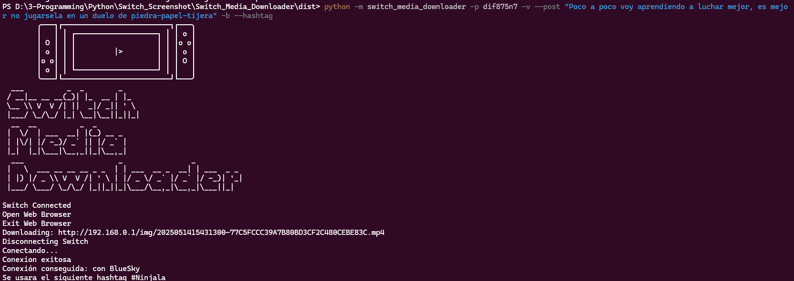
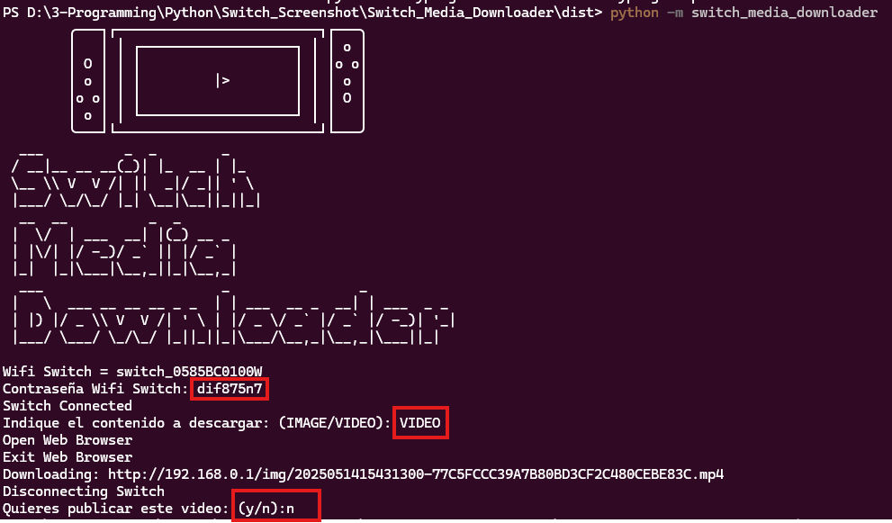
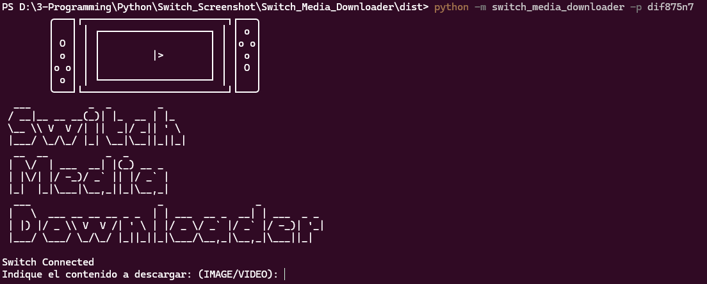

# Getting Started

This document contains a guide on how to install and use the program.

## Requirements:

A system running Windows and Python from version 3.12.5 to 3.13  
(*It does not work on Linux due to privilege issues, as working with network interfaces on Linux requires administrator privileges, and I don't want to request superuser access for this program*).

Poetry version 2.1.1 or higher [Installation link](https://python-poetry.org/docs/)

A Wi-Fi connection (To connect with the Nintendo Switch)

(Optional) A wired network connection as a secondary to the Wi-Fi network.

## Installation using Poetry (Recommended)

Clone this repository (Using HTTPS):
```bash
git clone https://github.com/ChaconMoon/Switch-Media-Downloader.git
```

OR

Clone this repository (Using SSH):
```bash
git clone git@github.com:ChaconMoon/Switch-Media-Downloader.git
```

Move to the repository folder:
```bash
cd Switch-Media-Downloader
```

Activate the Poetry virtual environment:
```bash
poetry env activate
```

Run the file returned by the command:

__Example__

```bash
C:\Users\Pc\AppData\Local\pypoetry\Cache\virtualenvs\switch-media-downloader-jPGjUOqm-py3.13\Scripts\Activate.ps1
```

Install the project dependencies:
```bash
poetry install
```

Run the program as a Python module:
```bash
python -m switch_media_downloader
```

## Installation using pip

Download the latest version of the package from the GitHub Releases.

Install the package using pip:

```bash
python -m pip install .\switch_media_downloader-0.1.0-py3-none-any.whl
```

Run the program as a Python module:
```bash
python -m switch_media_downloader
```

## Execution

This program can be used with parameters to automate its execution or with an interactive menu.

### With parameters

These are the parameters you can pass to the program to automate its behavior:

```
| Parameter           | Description                                                  |
|---------------------|--------------------------------------------------------------|
| `-h`, `--help`      | Shows the available parameters                               |
| `-p`, `--password`  | Wi-Fi network password                                       |
| `-v`, `--video`     | Downloads a video (mutually exclusive with `--image`)        |
| `-i`, `--image`     | Downloads images (mutually exclusive with `--video`)         |
| `--post`, `--msg`   | Post text for social media                                   |
| `-m`, `--mastodon`  | Posts to Mastodon                                            |
| `-t`, `--twitter`   | Posts to Twitter (X)                                         |
| `-b`, `--bluesky`   | Posts to Bluesky                                             |
| `--hashtag`         | Hashtag to include in the post if defined                    |
```

Example usage:

```bash
python -m switch_media_downloader -p dif875n7 -v --post "Little by little I'm learning to fight better, it's best not to risk it in a rock-paper-scissors duel" -b --hashtag
```

This example sets the Switch password to `dif875n7`, downloads a video, and posts it to Bluesky with the following text:  
*Little by little I'm learning to fight better, it's best not to risk it in a rock-paper-scissors duel #Gamename*



### Without parameters

If you prefer to run the program manually, you can execute the module without parameters and you will need to enter everything manually during execution.



If you'd like to provide a parameter such as the password during execution, it can be passed and will be automatically inserted instead of prompting the user.


