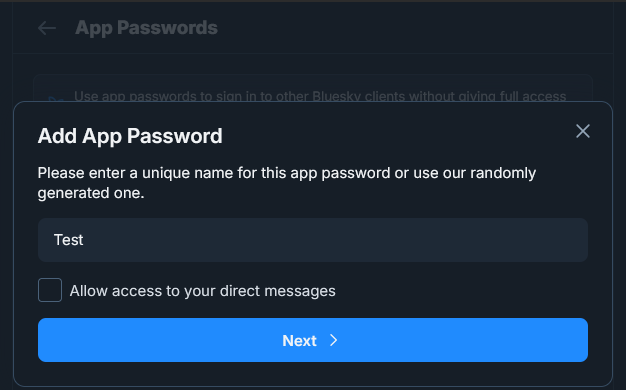
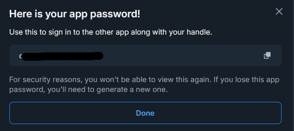
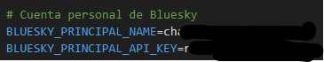

### Configuración para publicar en BlueSky.

Dirijase a la [configuración de privacidad y seguiridad de tu perfil de Bluesky.](https://bsky.app/settings/privacy-and-security)

Acceda a la sección de "App passwords" y genera una nueva clave.


Copia esa clave y pegala en el fichero ``.env_example`` junto con su nombre de usuario, en __BLUESKY_PRINCIPAL_API_KEY__ pegas la clave API y en __BLUESKY_PRINCIPAL_NAME__ pega tu nombre de usuario de bluesky (sin el arroba) y cambia su nombre a ``.env``.






Si quieres probar la conexión puedes usar las variables de entorno __BLUESKY_SECUNDARY_API_KEY__ y __BLUESKY_SECUNDARY_NAME__ y ejecutar los test de bluesky en tu cuenta, son otras claves pora que puedas usar otra cuenta para los tests.

```bash
poetry run pytest -v tests/implementation_tests/test_bluesky_API.py
```


