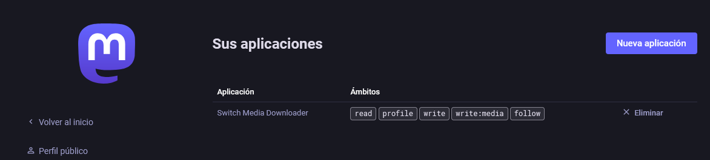
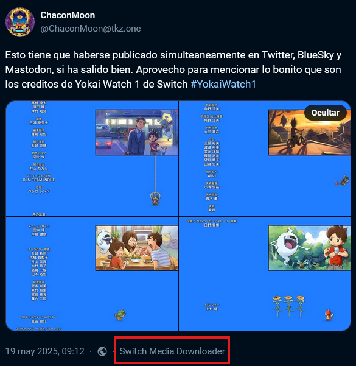
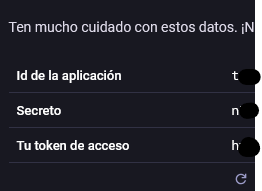
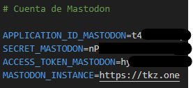

### Configuración para publicar en Mastodon.

Debes acceder a la sección "Sus aplicaciones" de la configuración de tu perfil en tu instacia de mastodon y crear una nueva aplicación. 

Enlace de ejemplo:

``https://[Tu_instacia_de_Mastodon]/settings/applications``

Al crear la aplicación rellena el formulario con el seguiente: 

Nombre de la aplicación: Puedes poner el nombre que quieras pero agrdeceria que uses el nombre del proyecto ``Switch Media Downloader``, este nombre se vera en todos los post que hagas con la aplicación.

__Ejemplo:__

En los permisos de la aplicación marca los siguientes:

[ x ] read (Leer información de la cuenta)

[ x ] profile (Leer información del perfil)

[ x ] write (Publicar en tu nombre)

Guarda los cambios y vuelve a acceder y obtendras las claves de acceso.

En el fichero .env_example pega esas credenciales en la sección de Mastodon junto con el nombre de tu instancia.

Por ultimo renombra el fichero a ``.env`` si no lo has hecho antes.
