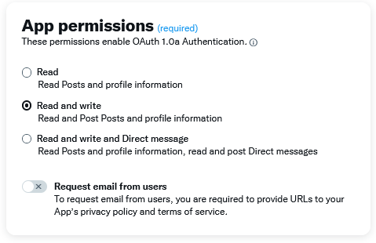
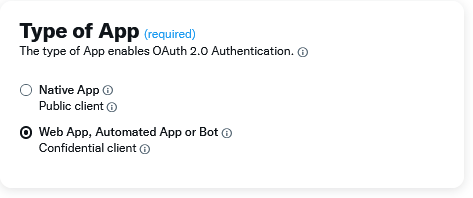
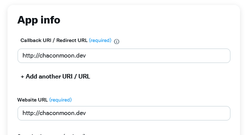
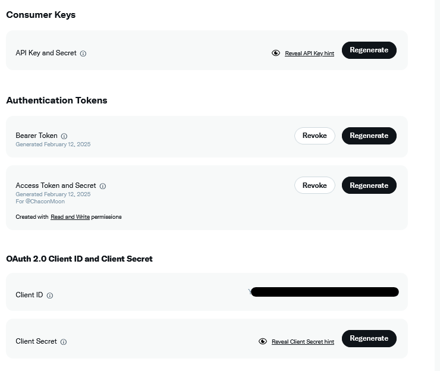
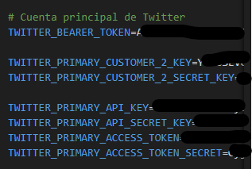

### Configuración para publicar en Twitter.

Para publicar en Twitter debes darte de alta como desarrollador en Twitter y crear un nuevo proyecto. 

[Enlace](https://developer.x.com/en/portal/projects-and-apps)

Esta aplicación debe tener los siguientes permisos:

En permisos de aplicación debes permitir leer y escribir en tu cuenta.

Y en el tipo de aplicación crea una App de Automatización o un bot.

Y la información de la App y pon un sitio web como información para la App.

Ahora en la pestaña Keys and Tokens y copiar los resppectivos Tokens en el fichero .env_example.

__Costumer Keys__

WITTER_PRIMARY_API_KEY = API_KEY

TWITTER_PRIMARY_API_SECRET_KEY = API_SECRET

__Authentication Tokens__

TWITTER_BEARER_TOKEN = BEAREN_TOKEN

TWITTER_PRIMARY_ACCESS_TOKEN = ACCESS_TOKEN

TWITTER_PRIMARY_ACCESS_TOKEN_SECRET = TOKEN_SECRET

__OAuth 2.0 Client ID and Client Secret__

TWITTER_PRIMARY_CUSTOMER_2_KEY = CLIENT ID

TWITTER_PRIMARY_CUSTOMER_2_SECRET_KEY = CLIENT_SECRET

Posteriormente renombra ese fichero a .env.